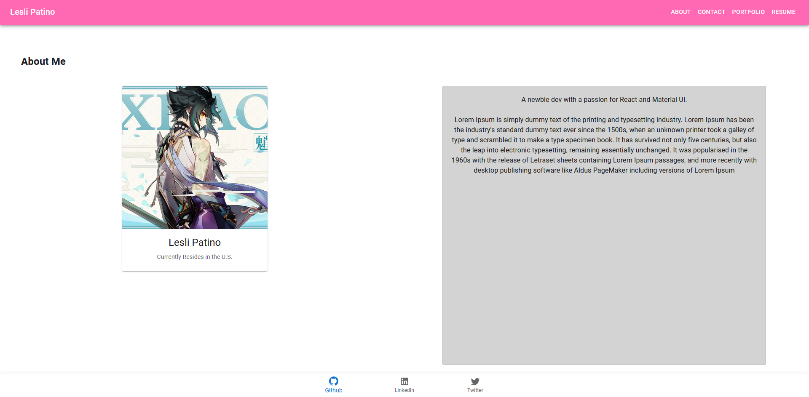

# React Portfolio

## Description

This app is built with React. I used the MUI React Framework for styling. You are able to navigate between these sections: "About", "Portfolio", "Resume", and "Contact Me".

The app currently does not have backend functionality.

## Installation
Run npm i to install dependencies if running on your local device.

## Usage
Free to use.

## Images
Image of About page:

## Future Development
I will add functionality to the Contact Me section. The "Download Resume" button will actually download the user's resume.